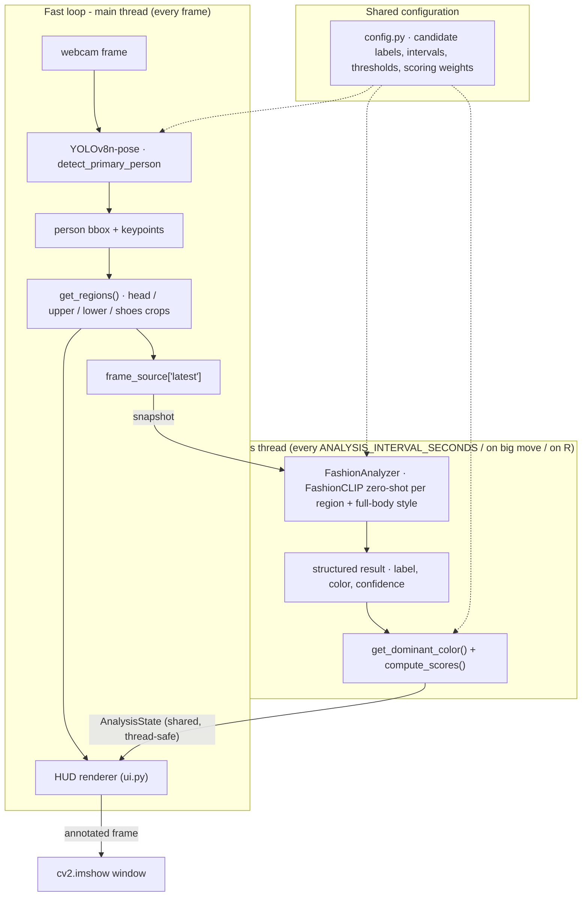

# FitCheck AI

A real-time webcam application that analyzes your current outfit — clothing
type, color, style/formality, and overall coordination — and displays a
transparent **FitCheck score out of 10**, drawn directly on the camera feed.

This is a **visual style/coordination estimate**, not a scientific
measurement of attractiveness, body quality, or personal worth. It only
reasons about clothing, color, and coordination — see "Limitations" below.

---

## 1. Features

- Live webcam feed with person detection and body-region localization
  (head/hair, upper body, lower body, shoes).
- Zero-shot fashion understanding (clothing type, color, style) using
  FashionCLIP — no custom model training.
- A clean, minimal overlay: thin region boxes, pointer lines, small
  translucent label cards, and a score card in the corner.
- A documented, weighted scoring formula (Section 6) — no random or
  hardcoded scores.
- GPU (CUDA) acceleration with automatic CPU fallback.
- Runs as a single local Python process — no Docker, no database, no
  backend/frontend split, no external API calls with your webcam frames.

## 2. Architecture



Two loops run concurrently:

- **Fast loop** (main thread): captures frames, runs the lightweight
  YOLOv8-pose person/keypoint detector every frame, and draws the overlay
  using the most recently cached analysis result. This keeps the webcam feed
  smooth.
- **Analysis loop** (background thread): runs FashionCLIP — the expensive
  step — only periodically (`ANALYSIS_INTERVAL_SECONDS` in `config.py`,
  default 1.5s), or sooner if the person moves significantly, or
  immediately when you press `R`. The result is cached and reused by the
  fast loop until the next analysis completes.

While a new analysis is running, the status chip shows `ANALYZING`; otherwise
it shows `RESULT READY` with the latest cached score.

## 3. Models used

| Model | Purpose | Why |
|---|---|---|
| `yolov8n-pose.pt` (Ultralytics) | Person detection + body keypoints | Single lightweight pass gives both a bounding box and shoulder/hip/ankle keypoints, which is all that's needed to carve out head/upper/lower/shoe crops. Runs every frame without hurting FPS. |
| `patrickjohncyh/fashion-clip` (Hugging Face) | Zero-shot clothing/style/hair classification | Fine-tuned specifically for fashion image-text similarity, so zero-shot candidate labels (t-shirt, hoodie, smart casual, etc.) work well without training a classifier. |

Clothing **color** is detected separately with plain OpenCV/NumPy (HSV
histogram + nearest-hue matching) — no extra model needed for something
that simple (see `scoring.py::get_dominant_color`).

## 4. Installation

Requires Python 3.13, a webcam, and (optionally) an NVIDIA GPU with CUDA.

```powershell
python -m venv .venv
.venv\Scripts\Activate.ps1

# Install the CUDA build of PyTorch that matches your system first.
# Check https://pytorch.org/get-started/locally/ for the exact command;
# example for CUDA 12.1:
pip install torch --index-url https://download.pytorch.org/whl/cu121

# Then install everything else:
pip install -r requirements.txt
```

If you don't have an NVIDIA GPU, install the CPU build of PyTorch instead
(`pip install torch`) — the app auto-detects and falls back to CPU.

## 5. `.env` setup

FashionCLIP is downloaded from the Hugging Face Hub, which requires a
(free) Hugging Face access token.

1. Create a token at https://huggingface.co/settings/tokens (read access is enough).
2. Copy `.env.example` to `.env`.
3. Fill it in:

```env
HF_TOKEN=your_huggingface_token_here
```

`.env` is git-ignored and never committed.

## 6. Downloading models

```powershell
python download.py
```

This will:

1. Load `HF_TOKEN` from `.env` and validate it's present.
2. Create `models/` if it doesn't exist.
3. Download FashionCLIP's safetensors weights into `models/fashion-clip/`.
4. Fetch `yolov8n-pose.pt` via Ultralytics and copy it into `models/`.
5. Skip any model that's already downloaded.
6. Exit with a clear error message if a download fails.

## 7. Running the application

```powershell
python app.py
```

A source selector opens: press `1` for the live webcam, `2` to pick a video
file (`*.mp4`, `*.avi`, `*.mov`, `*.mkv`, `*.webm`) from a native file
dialog, or `Esc` to quit. Uploaded videos are analyzed frame-by-frame and
loop when they end (press `Space` to pause).

You can also skip the menu:

```powershell
python app.py            # shows the source selector
python app.py camera     # straight to live webcam
python app.py clip.mp4   # straight to a specific video file
```

The camera window opens immediately; step into frame and the overlay and
score card populate after a moment.

## 8. Controls

| Key | Action |
|---|---|
| `Q` / `Esc` | Quit |
| `R` | Re-analyze immediately |
| `Space` | Freeze / unfreeze the frame |
| `S` | Save the current annotated frame to `outputs/` |

## 9. Scoring methodology

The overall FitCheck score is a weighted average of six components, each
computed from real detected values (FashionCLIP similarity confidences and
OpenCV color analysis) — never randomized or hardcoded:

| Component | Weight | How it's computed |
|---|---|---|
| Color coordination | 25% | HSV-based dominant colors of top/bottom/shoes are compared on a simplified color wheel; harmonious/neutral pairings score higher than clashing saturated pairings. |
| Top + bottom combination | 25% | Average of FashionCLIP's top/bottom classification confidence, blended with the color-coordination score. |
| Style consistency | 20% | FashionCLIP's confidence for the best-matching overall style label (casual, smart casual, formal, streetwear, etc.) on the full-body crop. |
| Overall outfit balance | 15% | How consistently confident detection was across top/bottom/shoes/style — a coherent look tends to classify confidently everywhere; mixed/ambiguous signals lower this score. |
| Footwear coordination | 10% | FashionCLIP's confidence for the shoe-type classification. |
| Hair/grooming | 5% | FashionCLIP's confidence for the hair-category classification on the head crop. |

```
overall_score = clamp(sum(component_score * weight for each component), 0.0, 10.0)
```

rounded to one decimal place. See `scoring.py::compute_scores` for the exact
implementation and `config.py::SCORE_WEIGHTS` for the weights.

Every attribute always reports its best-supported candidate label (the
model's top similarity match among the configured labels) — the UI never
shows "Unknown" / "Not clear". If the model's confidence for that pick is
low, the confidence still scales the score honestly rather than falling back
to a neutral mid-value, so an uncertain detection reads as a mid score, not
as if the outfit were confirmed.

## 10. Performance notes

- FashionCLIP inference runs roughly every 1.5 seconds (configurable via
  `ANALYSIS_INTERVAL_SECONDS`), not every frame, so the webcam feed itself
  stays smooth even while analysis is running in the background.
- YOLOv8n-pose runs every frame but is small and fast enough on both CPU
  and GPU for real-time use.
- On the target hardware (RTX 3050 6GB), both models comfortably fit in
  VRAM with room to spare.
- All models load exactly once at startup and are reused for the entire
  session.

## 11. Limitations

- This tool analyzes **clothing, color, and coordination only**. It does
  not and cannot assess attractiveness, personality, social status,
  wealth, body quality, gender expression, health, or character, and it
  makes no such claims.
- Lighting, webcam quality, and camera angle affect color and clothing-type
  accuracy.
- Loose/baggy or heavily layered clothing can make body-region boundaries
  (from pose keypoints) less precise.
- Hair and accessory categories are broad on purpose (e.g. "textured hair",
  "ponytail"); the model picks the closest supported broad category and
  never invents specifics such as brand, fabric, or an exact haircut.
- Zero-shot classification is inherently approximate; it reflects
  similarity to the given text labels, not ground truth.

## 12. License / model attribution

- FashionCLIP: `patrickjohncyh/fashion-clip` on the Hugging Face Hub —
  see the model card for its license and citation details.
- YOLOv8-pose: Ultralytics — see the Ultralytics repository for license
  terms (AGPL-3.0 / Ultralytics Enterprise License, depending on use).
- This project's own code has no bundled license file by default; add one
  if you plan to distribute it.
